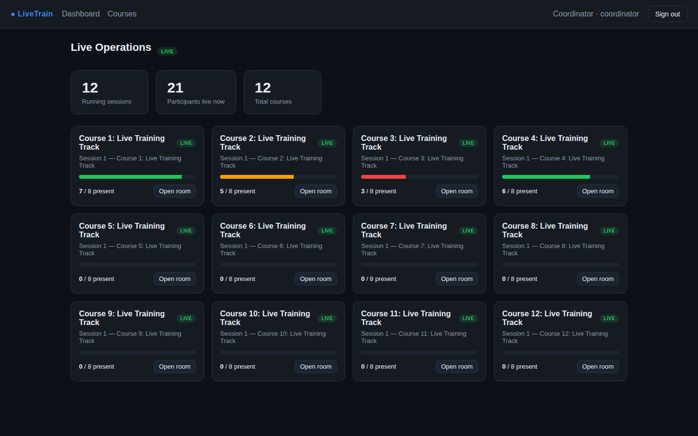
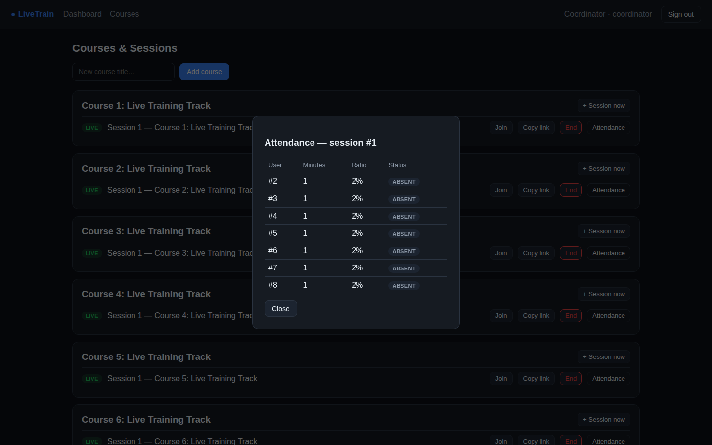
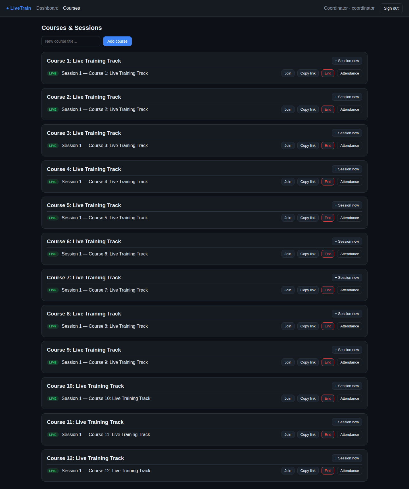
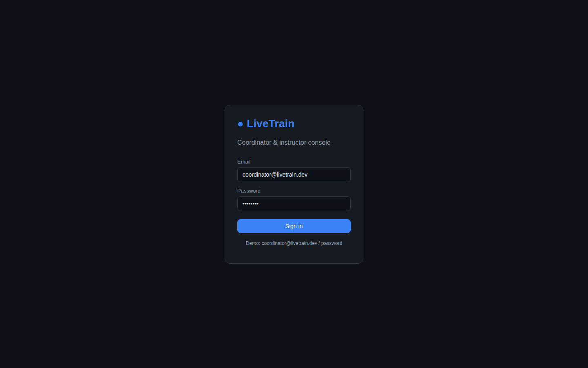

# LiveTrain — Live Online Training Platform

A platform for running **up to 100 live online courses simultaneously**, where a
single coordinator can monitor every running session from one dashboard and
**attendance is captured automatically** — no manual register, for every course
at once.

Instead of bolting onto Zoom / Teams / Meet, LiveTrain ships its own WebRTC
video rooms. Because we own the signaling, every join, leave, and heartbeat is
logged at the source, and an attendance engine derives a precise, tamper-evident
register for each session.

## Screenshots

| Coordinator dashboard | Automated attendance |
|---|---|
|  |  |

| Courses & sessions | Sign in |
|---|---|
|  |  |

The dashboard shows one coordinator watching many courses live at once, with
per-course presence bars; the register is computed automatically from join/leave
events — no manual roll call.

---

## Why a custom platform?

Automated attendance is only as good as the join/leave signal it's built on.
Third-party meeting APIs expose that signal inconsistently and with delay. By
owning the room, LiveTrain gets:

- **Exact presence** — every participant's join/leave/heartbeat timestamped server-side.
- **Crash tolerance** — a student whose laptop dies is closed out at their last
  heartbeat, not credited for the whole class.
- **One coordinator, 100 rooms** — a live dashboard that updates by websocket as
  people come and go, with zero polling.

---

## Architecture

```
                    ┌─────────────────────────────┐
  Coordinator  ───► │  Dashboard (React)          │ ◄── live presence (WebSocket)
                    └─────────────┬───────────────┘
                                  │ REST + WS
                    ┌─────────────▼───────────────┐
  Students/    ───► │  FastAPI backend            │
  Instructors       │   • auth (JWT, roles)       │
   (WebRTC room)    │   • courses / enrollment    │
                    │   • sessions (live/ended)   │
                    │   • room signaling (WS)  ───┼──► PresenceEvent log (append-only)
                    │   • attendance engine    ◄──┘        │
                    └─────────────┬───────────────┘        ▼
                                  │                 AttendanceRecord (derived)
                            ┌─────▼─────┐
                            │ Postgres  │
                            └───────────┘
```

**Attendance pipeline:** every join/leave is written as an append-only row in
`presence_events`. The source of those rows depends on the video backend:

- **LiveKit (production):** LiveKit calls `/api/livekit/webhook` on
  `participant_joined` / `participant_left`; we translate each into a presence
  event. No persistent socket on our side — so the backend runs on serverless.
- **Mesh (fallback):** the room websocket logs join/leave/heartbeat directly.

Either way the attendance engine (`app/core/attendance_engine.py`) replays a
session's events into present-seconds per student, divides by session length,
and classifies each as `present` / `partial` / `absent` against configurable
thresholds — **idempotent and log-derived**, so restarts, duplicate joins, and
dropped connections never corrupt the register. It recomputes on each leave
webhook, on session end, and on demand (`?recompute=true`).

---

## Tech stack

| Layer     | Choice                                  |
|-----------|-----------------------------------------|
| Backend   | Python · FastAPI · SQLAlchemy 2         |
| Database  | PostgreSQL                              |
| Realtime  | LiveKit webhooks · dashboard polling    |
| Video     | LiveKit SFU (built-in WebRTC mesh fallback) |
| Frontend  | React · Vite · React Router             |
| Deploy    | Vercel (frontend + serverless API) · Docker Compose |

---

## Quick start (Docker)

```bash
docker compose up --build
# Frontend  → http://localhost:8080
# API docs  → http://localhost:8000/docs
```

Seed demo data (12 courses, all live, with enrolled students):

```bash
docker compose exec backend python -m app.seed
```

Then sign in as **coordinator@livetrain.dev / password** to see every running
course on the dashboard.

## Local development

**Backend**
```bash
cd backend
python -m venv .venv && source .venv/bin/activate
pip install -r requirements.txt
cp .env.example .env                 # uses Postgres by default
uvicorn app.main:app --reload
python -m app.seed                   # optional demo data
pytest                               # attendance engine tests
```

**Frontend**
```bash
cd frontend
npm install
npm run dev                          # http://localhost:5173 (proxies API to :8000)
```

---

## Roles

| Role          | Can do                                                         |
|---------------|----------------------------------------------------------------|
| `admin`       | Everything                                                     |
| `coordinator` | The live dashboard across all courses; manage courses/sessions |
| `instructor`  | Manage and run their own courses/sessions                      |
| `student`     | Join live rooms (attendance captured automatically)            |

---

## Key API endpoints

| Method | Path                               | Purpose                              |
|--------|------------------------------------|--------------------------------------|
| POST   | `/api/auth/register` · `/login`    | Accounts & JWT                       |
| GET    | `/api/courses`                     | List / create courses                |
| POST   | `/api/sessions/{id}/start` · `/end`| Open / close a live room             |
| GET    | `/api/sessions/{id}/attendance`    | Per-student register (`?recompute`)  |
| GET    | `/api/dashboard/summary`           | Snapshot of all running courses      |
| WS     | `/api/dashboard/live`              | Live presence push to coordinator    |
| WS     | `/ws/rooms/{room_id}?token=…`      | Join a room (WebRTC + attendance)    |

---

## Deploy live: Vercel + LiveKit

The platform is configured to go live on **Vercel** (frontend + serverless API)
with **LiveKit** as the media server. You'll need three free-tier accounts:
**Vercel**, **LiveKit Cloud**, and a serverless **Postgres** (e.g. Neon).

1. **Push this repo to GitHub** (Vercel deploys from a git repo).

2. **LiveKit Cloud** → create a project. Copy the **WSS URL**, **API key**, and
   **API secret**. Under the project's **Webhooks**, add:
   `https://<your-backend-host>/api/livekit/webhook`

3. **Postgres** → create a Neon database and copy its pooled connection string
   (as `postgresql+psycopg://…`).

4. **Backend → Vercel** (new project, root directory = `backend/`). Env vars:
   ```
   DATABASE_URL=postgresql+psycopg://…   (Neon, pooled)
   SECRET_KEY=<long random>
   LIVEKIT_URL=wss://<your>.livekit.cloud
   LIVEKIT_API_KEY=…
   LIVEKIT_API_SECRET=…
   CORS_ORIGINS=https://<your-frontend>.vercel.app
   ```
   `backend/vercel.json` serves the FastAPI app as a Python serverless function.

5. **Frontend → Vercel** (new project, root directory = `frontend/`). Env var:
   ```
   VITE_API_BASE=https://<your-backend>.vercel.app
   ```

6. Open the frontend URL, sign in, start a session, and hit **Copy link** — that
   shareable `/room/<id>` link drops anyone enrolled straight into the live
   LiveKit room, with attendance captured automatically.

> **Note on serverless:** with LiveKit the backend uses no long-lived sockets,
> so it fits Vercel's model. Prefer a persistent host? The included
> `backend/Dockerfile` + `docker-compose.yml` run the same app on Render,
> Railway, Fly.io, or any VPS unchanged.

## Self-host on your own server & domain

Want **everything on your own infrastructure** — your VPS, your domain, no third
party (including self-hosted LiveKit)? See **[`deploy/SELF_HOSTING.md`](deploy/SELF_HOSTING.md)**.
It ships a one-command production stack (`deploy/docker-compose.prod.yml`) with
Postgres, the API, the web app, a **self-hosted LiveKit SFU**, and **Caddy** for
automatic HTTPS on your domains.

## Scaling to 100 concurrent courses

- **Media:** LiveKit (the configured backend) is a production SFU and scales to
  large classes out of the box. The built-in mesh remains as a no-dependency
  fallback for small cohorts / local dev. The attendance layer is independent of
  media transport.
- **Realtime:** live counts are derived from the presence-event log in the DB,
  so the dashboard scales horizontally with no shared in-memory state — any
  serverless instance can serve it.
- **Attendance:** computed from the event log in a single cheap pass per session;
  recomputed on each LiveKit leave webhook and on session end.

## Project layout

```
backend/
  app/
    api/        auth, courses, sessions, dashboard, rooms (WS)
    core/       security, deps, attendance_engine, realtime (RoomHub)
    models/     users, courses, sessions, attendance
    schemas/    Pydantic request/response models
    seed.py     demo data
  tests/        attendance engine unit tests
frontend/
  src/
    pages/      Login, Dashboard, Courses, Room (WebRTC)
    context/    AuthContext
    api/        REST + WS client
docker-compose.yml
```

## Roadmap

- [x] SFU integration (LiveKit) for large rooms
- [x] Generated shareable join links
- [x] Vercel-ready serverless deployment
- [ ] Recurring schedules & calendar invites
- [ ] CSV / SIS export of attendance registers
- [ ] Recording & breakout rooms (LiveKit Egress)
- [ ] Alembic migrations (currently `create_all` on startup)
